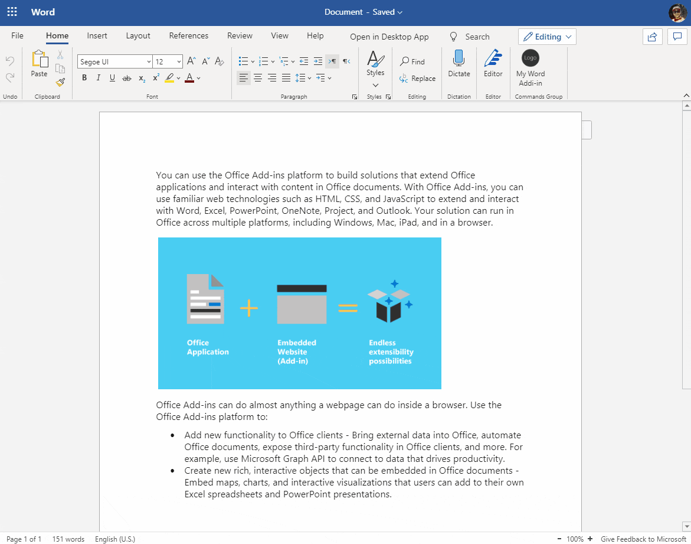

# Summary

This sample shows how you can get multiple resources from Azure AD using MSAL. Please read [this blog post](https://ramin.expert/?p=303) to get more information how I implemented this solution.

## Office-Addin-TaskPane-React

This repository contains the source code used by the [Yo Office generator](https://github.com/OfficeDev/generator-office) when you create a new Office Add-in that appears in the task pane. 

## TypeScript

This template is written using [TypeScript](http://www.typescriptlang.org/). For the JavaScript version of this template, go to [Office-Addin-TaskPane-React-JS](https://github.com/OfficeDev/Office-Addin-TaskPane-React-JS).

## Additional resources

* [Office add-in documentation](https://docs.microsoft.com/office/dev/add-ins/overview/office-add-ins)
* More Office Add-in samples at [OfficeDev on Github](https://github.com/officedev)

